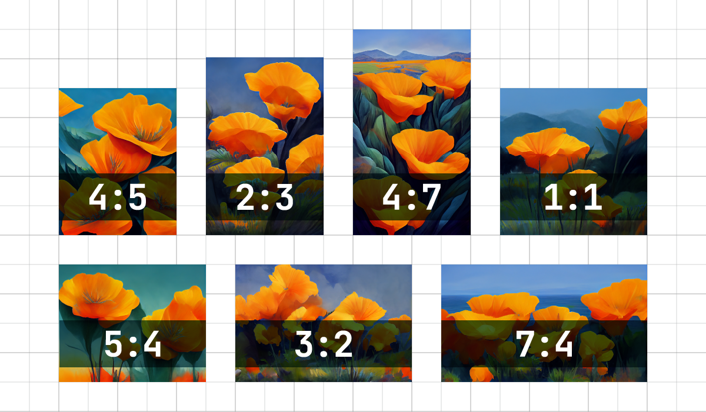

# Aspect Ratios（长宽比）

------

#### `——aspect`或`——ar`参数改变生成图像的长宽比（实际上是图像的宽高比）。它通常表示为用冒号分隔的两个数字，例如7:4或4:3。Midjourney默认的长宽比是1:1。

正方形图像具有相等的宽度和高度，描述为1:1的宽高比。图像可以是1000px × 1000px，也可以是1500px × 1500px，长宽比仍然是1:1。

电脑屏幕的常见比例是16:10。宽度是高度的1.6倍。所以图片可以是1600px × 1000px, 4000px × 2000px, 320px × 200px等等。

> `——aspect`必须使用整数。**使用139:100代替1.39:1**。

------

### 最大值长宽比

**各版本之间有一定差异，特别是在V4版本及以下.**

|        | Version 5 | Version 4  | niji 5 |
| :----: | :-------: | :--------: | :----: |
| Ratios |   any*    | 1:2 to 2:1 |  any*  |

`——ar`参数将接受任何宽高比，从1:1(正方形)到每个模型的最大宽高比。但是，在图像生成或升级期间，最终输出可能会略有修改。示例:提示使用`——ar 16:9 `(1.78)创建具有` 7:4 `(1.75)宽高比的图像。

长宽比大于2:1是实验性的，可能会产生不可预测的结果。

prompt 示例: `imagine/ prompt` `vibrant california poppies --ar 5:4`

### 常见的Midjourney长宽比

`--aspect 1:1` 默认的宽高比.
`--aspect 5:4` 常见的帧装和打印比例.
`--aspect 3:2` 在印刷摄影中常见.
`--aspect 7:4` 接近高清电视屏幕和智能手机屏幕.

------

## Aspect Ratio参数的用法

### 

增加 `--aspect <value>:<value>`, 或 `--ar <value>:<value>` 在prompt的结尾处.

动态示例：
