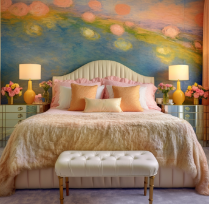
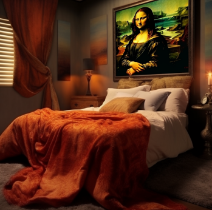
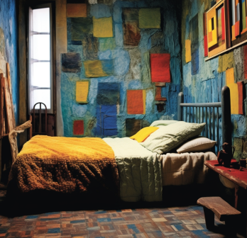
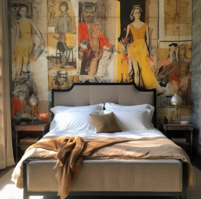
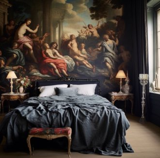
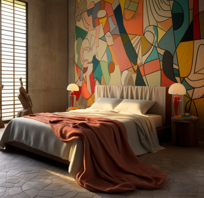
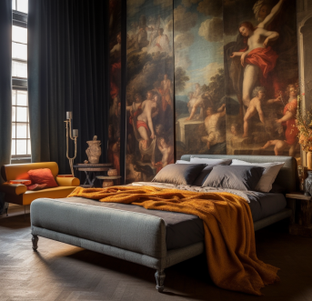
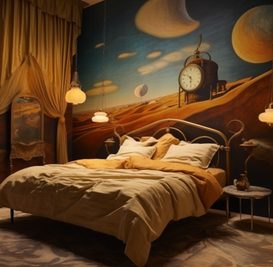
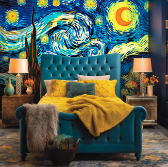
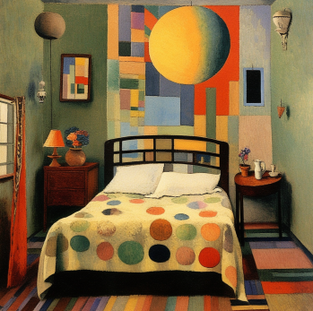

# Artist（艺术家风格）

| 名称                           | 图片                                                         | 说明                                                         |
| ------------------------------ | ------------------------------------------------------------ | ------------------------------------------------------------ |
| Claude Monet                   |      | 克劳德·莫奈：法国画家，印象派代表人物和创始人之一。有《睡莲》、《日出·印象》等代表作。没有明显的轮廓线和清晰的阴影，通过光和影的色彩描绘是莫奈绘画的最大特色。 |
| Jackson Pollock                |  | 杰克逊·波洛克：美国画家，抽象表现主义绘画大师，其创作不作事先规划，作画没有固定位置，喜欢在画布四周随意走动，以反复的无意识的动作画成复杂难辨、线条错乱的网，人称“行动绘画”。此画法构图设计没有中心，结构无法辨识，具有鲜明的抽象表现主义特征。 |
| Leonardo da Vinci              |  | 列奥纳多·达·芬奇：意大利文艺复兴时期最完美的代表，绘画把科学知识和艺术想象有机地结合起来，使当时绘画的表现水平发展到一个新阶段。把解剖、透视、明暗和构图等零碎的知识，整理成为系统的理论。《蒙娜丽莎》、《最后的晚餐》等是其代表作。 |
| Max Ernst                      |            | 马克斯·恩斯特：德裔法国画家，雕塑家，在达达运动和超现实主义艺术中处于领导地位，作品想象力漫无边际，表达世界的荒诞之感。擅于运用拼接画、摩擦法、拓印法、刮擦法等方式创造一个多变、彩色的虚幻世界。 |
| Norman Rockwell                |  | 诺曼·洛克威尔：著名插画家，以记录时事和社会为主。            |
| Paul Cézanne                   |      | 保罗·塞尚：法国后印象主义画派画家、现代绘画之父。其最大成是对色彩与明暗具有前所未有的精辟分析，颠覆了以往的视觉透视点，空间的构造被从混色彩的印象里抽掉了，使绘画领域正式出现纯粹的艺术。《玩牌者》、《浴女们》、《圣维克多山》和《缢死者之屋》等是其代表作。 |
| Peter Paul Rubens              |  | 彼得·保罗·鲁本斯：西班牙画家，出生地德国锡根，家乡比利时安特卫普，巴洛克画派早期代表人物。代表作：《阿玛戎之战》、《强劫留西帕斯的女儿》、《美惠三女神》、《下十字架》。 |
| Pablo Picasso                  |              | 巴勃罗·毕加索：西班牙画家，现代艺术的创始人，西方现代派绘画的主要代表。毕加索是当代西方最有创造性和影响最深远的艺术家，是20世纪最伟大的艺术天才之一。代表作品:《格尔尼卡》《和平鸽》《亚威农少女》《生命》。主要绘画手法是立体绘画。 |
| Rembrandt Harmenszoon van Rijn |  | 伦勃朗·哈尔曼松·凡·莱因：荷兰历史上最伟大的画家。擅长肖像画、风景画、风俗画、宗教画、历史画等领域。代表作包括《木匠家庭》、《夜巡》、《三棵树》、《浪子回头》、《尼古拉·特尔普教授的解剖课》等。 |
| Salvador Dali                  |    | 萨尔瓦多·达利：西班牙加泰罗尼亚画家，超现实主义作，怪异梦境般的形象，与卓越的绘图技术，和受文艺复兴大师影响的绘画技巧，令人惊奇地混合在一起，具有非凡才能和想象力。代表作有《记忆的永恒》《一条安达鲁狗》《内战的预兆》。 |
| Vincent van Gogh               |              | 文森特·梵高：荷兰后印象派画家，作品中充满天然的悲悯情怀和苦难意识，对色彩的偏好几乎达到了一种癫狂的状态，造型狂野，厚重、粗犷的笔触带来的是一种直率而又单纯的表现方式。代表作有《星月夜》、自画像系列、向日葵系列等。 |
| Wassily Kandinsky              |  | 瓦西里·康定斯基：出生于俄罗斯的法国画家和美术理论家，抽象艺术的先驱，现代抽象艺术奠基人。擅于用点线面绘画，构图抽象，纯粹形式和色彩的语言。代表作包括《基辅大门》、《蓝色之山》等。 |

