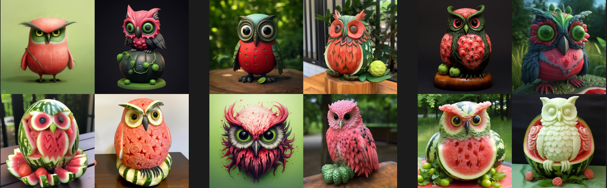

# Chaos（随机性、混沌）

`--chaos`或`--c`参数影响初始图像网格的变化程度。

*我更愿意将Chaos翻译为随机性，因为混沌这个词还是很哲学的，太难理解了！*

 高的`--chaos`值：产生更多不寻常和意想不到的结果和作品。

 较低的`--chaos`值：具有更可靠，可重复的结果。

> --chaos 取值范围 0–100.
> 默认值为 0.

------

## 了解Chaos的魔力

### 没有`—chaos`值的情况

强行指定`--chaos`值为0，将在每次运行Job时生成相似的初始图像网格。

prompt示例:`imagine/ Prompt ` `watermelon owl hybrid --c 0 `

3次运行的结果图

### 低`--chaos`值的情况

使用比较低的`--chaos`值，或者不指定值，将生成初始图像网格，每次运行Job时，这些网格都会略有变化。

prompt示例: `imagine/ prompt` `watermelon owl hybrid --c 10`

### 中等 `--chaos` 值

使用中低 `--chaos` 值, 每次运行作业时想象力会更加丰富.

prompt 示例: `imagine/ prompt` `watermelon owl hybrid --c 25`

### 高 `--chaos` 值

使用一个更高的 `--chaos` 值，会在每次作业运行时产生更加多样化和意想不到的图像。

prompt 示例: `imagine/ prompt` `watermelon owl hybrid --c 50`

### 极高的 `--chaos` 值

使用极其高的 `--chaos` 值会在每次作业运行时产生不同的初始图像网格，并且具有意想不到（天马行空）的组成或艺术媒介.

prompt 示例: `imagine/ prompt` `watermelon owl hybrid --c 80`

------

## 用法

### 使用 `--chaos` 或 `--c` 来调用参数

