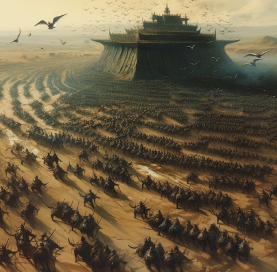
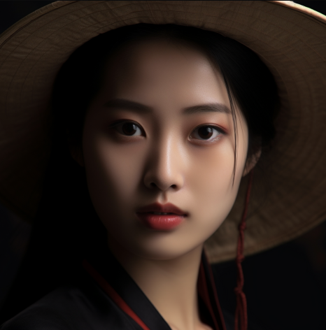
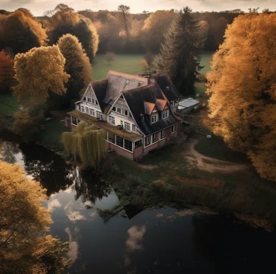
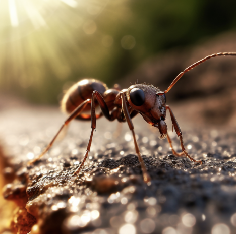
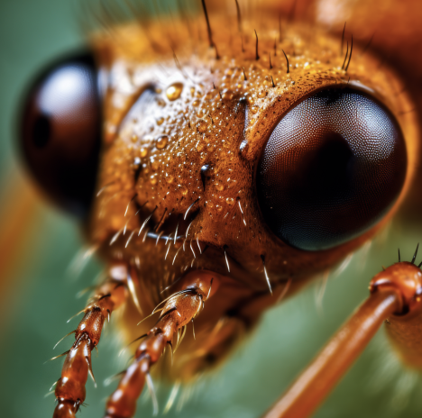
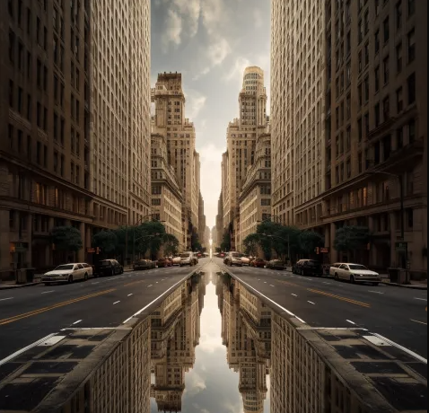
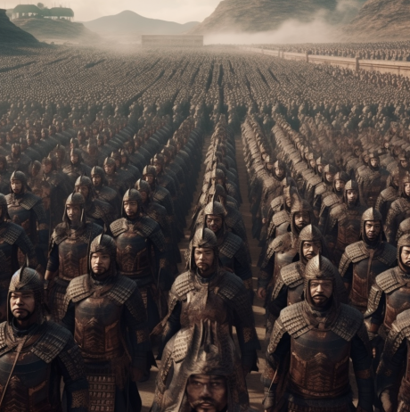
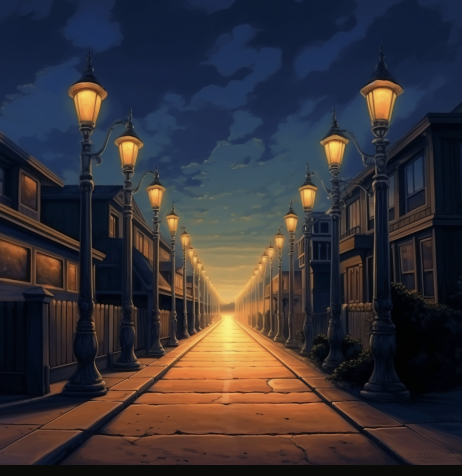
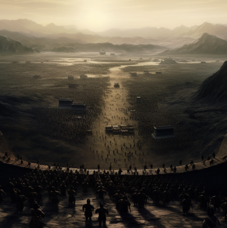

# 镜头视角

| 名称             | 图片                                                         | 说明                                                         |
| ---------------- | ------------------------------------------------------------ | ------------------------------------------------------------ |
| Bird View        |       | 鸟瞰：从高处俯瞰地面的视角，类似于鸟在空中俯瞰地面的视野。   |
| Close Up         |         | 特写镜头：摄影或电影中的一种镜头，主要用于拍摄人物的脸部或其他细节。 |
| Drone            |             | 无人机视角：相对于鸟瞰来说，更适合静态的画面                 |
| Extreme Close Up |  | 极度特写镜头：比如对马路上的一只蚂蚁进行特写                 |
| Front View       |     | 正面视角：从正面观察物体或场景的视图。                       |
| GoPro            |             | 自拍视角：一般是运动相机的自拍角度                           |
| Macro Shot       |     | 显微镜视角：微观情况下的拍摄                                 |
| Symmetrical      |  | 视觉对称：默认会呈现左右对称的画面，甚至上下对称             |
| Up View          |           | 近处观察视角：也可以理解为低空拍摄，抵近拍摄                 |
| Vanishing Point  |  | 消失点：画面无限延伸，不会显示重点，营造一种终点只在观察者脑海中的画面 |
| Wide View        |       | 广阔视野：视野会比较宏大壮阔                                 |

