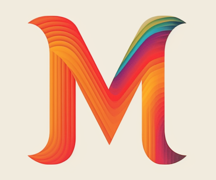
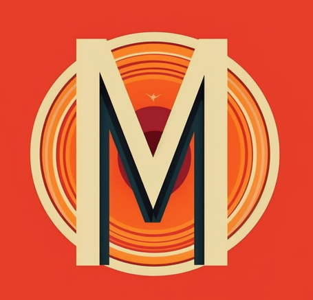

# Logo设计师

| 名称                       | 图像                                                         | 说明                                                         |
| -------------------------- | ------------------------------------------------------------ | ------------------------------------------------------------ |
| **Ruth Kedar**             |   | Kedar最著名的作品就是Google的Logo，她出生于巴西，后定居以色列并获得建筑学学位，在斯坦福大学获得设计硕士，后来在该校担任了15年的艺术设计顾问，从1994年起Art.Net就开始不断展示其设计作品。 |
| **Herbert l. Lubalin**     |  | 美国知名图形设计师，曾为Eros、Avant grade及Fact三家知名杂志提供美工设计，现在一家新成立的国际印刷设计公司工作。 |
| **Paul Rand**              |     | IBM和ABC的Logo都出自Rand之手，作为一位平面设计师Rand专注于公司Logo设计，曾为苹果、惠普等多家知名企业工作，是设计界瑞士风格的开创者之一，曾任教于耶鲁大学，1972年被纽约艺术名人堂收录。 |
| **Walter Landor**          |  | 因设计联邦快递Logo著称，Landor生于慕尼黑，是一位著名的品牌设计师，并创办了 Landor。设计过的品牌标志包括Del Monte、万宝路、富士、Tab&Bank of America，也设计了众多航空公司标志，如英国航空公司、日本航空公司以及新加坡航空公司。 |
| **Wally Olins**            |  | Olins在品牌设计领域大名鼎鼎，曾担任沃尔夫奥林斯的主席，2001年成立Saffron公司。他在1999年获CBE奖，2006年获得Reputation institutes首次颁发的终身成就奖。 |
| **Milton Glaser**          |  | 以设计I love new york标志著称，1974年创办Milton Glaser工作室，他的作品屡获 Art Directors、Type directors以及American Institute of graphic arts大奖。 |
| **Bob Gill**               |       | 曾为苹果唱片、Rainbow剧院、环球唱片、High times杂志以及联合国做设计，多次获奖，并为多部电影设计片名。 |
| **Alan Fletcher**          |  | 1962年Fletcher和Colin Forbes及Bob Gill成立了Fletcher/Forbes/Gil设计公司，他曾为路透社、维多利亚、Albert博物馆以及Institute of Directors设计Logo，1965年获Prince Philip Prize设计奖。 |
| **Chermayeff and Geismar** |  | 这是一家由Ivan Chermayeff和Tom Geismar创办的设计公司，曾为美孚石油、PBS美国公共广播公司、大通银行、施乐、美国国家地理杂志等设计Logo，也曾为阿玛尼、赫斯特等进行设计工作。 |
| **Saul Bass**              |     | Saul bass多才多艺，是一位杰出的图形设计师和制片人，主要从事电影海报、Logo设计等。其作品包括Avery Internation、美国大陆航空以及联合航空等的Logo。 |

