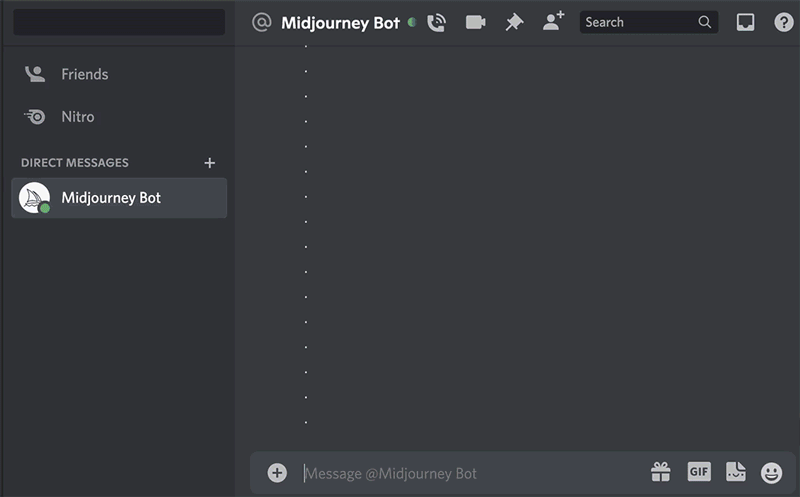

# Image Prompts

#### 可以使用图像作为prompt的一部分来影响作业的构图、样式和颜色。图像prompt可以单独使用，也可以与文本提示一起使用。尝试将不同风格的图像结合使用，以获得最令人兴奋的结果。

要将图像添加到prompt中，需要先将图像存储在可访问的网络上，然后键入或粘贴在线存储图像的网址。地址必须以.png、.gif或.jpg等扩展名结尾。添加图像地址后，添加任何其他文本和参数以完成prompt。

>  图像prompt放在提示符的前面；

> prompt必须有两个图像或一个图像和文本才能工作；

> 图像URL必须是指向在线图像的直接链接；

> 您的文件应该以.png、.gif、.webp、.jpg或.jpeg结尾；

> 在大多数浏览器中，右键单击或长按图像并选择复制图像地址以获得URL。`/blend`命令是针对移动用户优化的简化图像prompt过程。

------

## 上传图片到Discord

要将图像合并到prompt中，需要一个以 .png, .gif, .webp, .jpg, 或 .jpeg结尾的直接图像链接。如果图片在你的电脑或手机上，你可以先把它作为一条信息发送给Midjourney Bot，以生成一个链接。

### 如何上传图片

1. 将图像粘贴到Midjourney Bot聊天中。按Enter键发送您的图像。
2. 根据您的平台，请按照以下步骤获取图像链接:
   - 右键单击图像并选择“复制链接”(不是“复制消息链接”)。
   - Discord Web App:点击展开图片，然后右键选择“复制图片地址”。
   - Discord移动应用程序:点击并按住图片，然后选择“复制媒体链接”。
   - 如果这些方法都不起作用，您可以随时单击以展开图像，并在底部选择“在浏览器中打开”，这样您就可以复制并粘贴图像的URL。

## 添加图片URL到Prompt

.要在prompt中添加图像，请像往常一样输入 `/imagine`。在提示框出现后，将图像文件拖拽到提示框中以添加图像的URL，或者右键单击并将链接粘贴到提示框中。

------

## Image Weight 参数

使用图像权重参数`-iw`来调整prompt中图像与文本部分的重要性。当不指定`--iw`时使用默认值。更高的值意味着图像提示将对完成的作业产生更大的影响。有关提示各部分之间的相对重要性的详细信息.

|                       | Version 5 | Version 4 | niji 5 |
| :-------------------: | :-------: | :-------: | :----: |
|  Image Weight 默认值  |     1     |    NA     |   1    |
| Image Weight 取值范围 |    0–2    |    NA     |  0–2   |

prompt 示例: `/imagine prompt` `flowers.jpg birthday cake --iw .5`

