# 灯光效果

| 名称                     | 图片                                                         | 说明                                                         |
| ------------------------ | ------------------------------------------------------------ | ------------------------------------------------------------ |
| Back Lighting            | 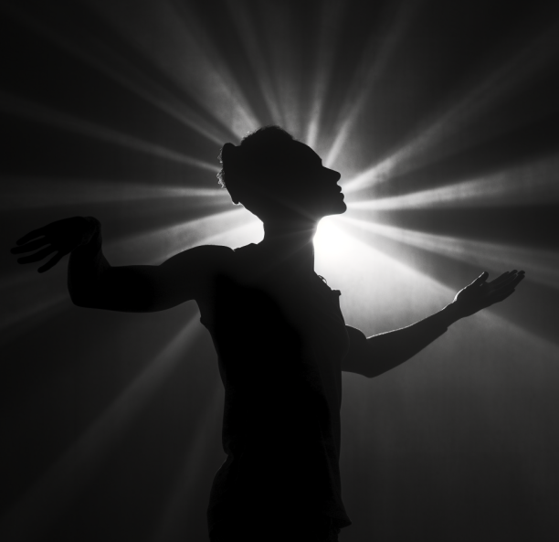 | 逆光：一种摄影技巧，光线从主体背后照射，使主体呈现出轮廓光的效果。 |
| Beautiful Lighting       | 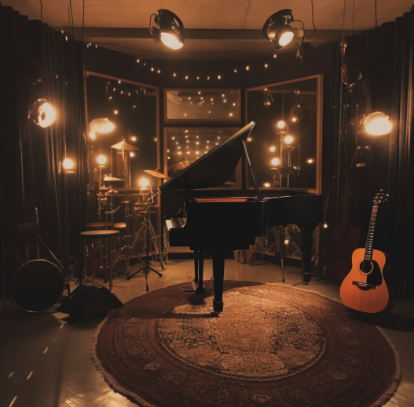 | 美丽灯光：使得室内光线非常漂亮                               |
| Bright Lighting          | 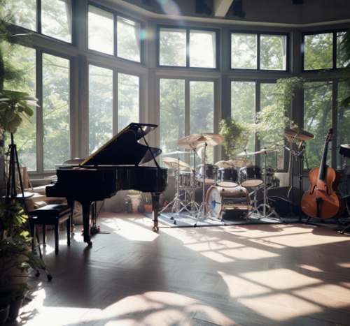 | 明亮采光：白天、有阳光、把窗帘完全拉开的感觉                 |
| Cold Lighting            | 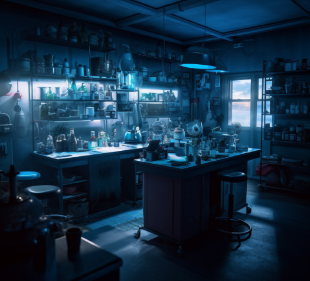 | 冷色光：冷色系的光线，一般适合实验室、研究所等               |
| Cove Lighting            | 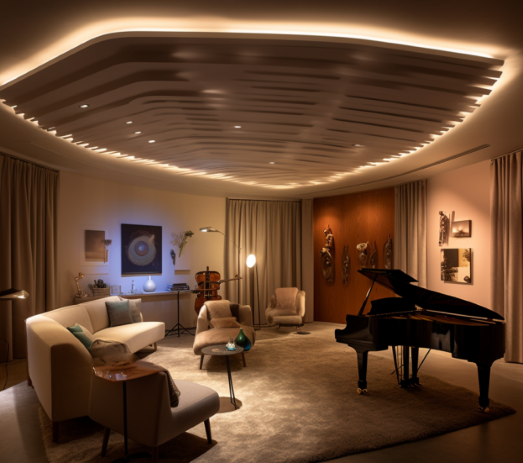 | 槽灯：一种安装在天花板或墙壁上的间接照明方式，通常用于营造柔和的氛围。 |
| Dramatic Lighting        | 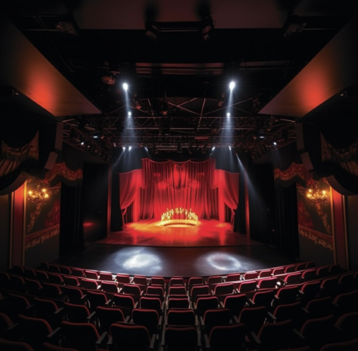 | 舞台照明：一般舞台灯光会比较亮，还可能存在聚光灯             |
| Gold Hour Lighting       | 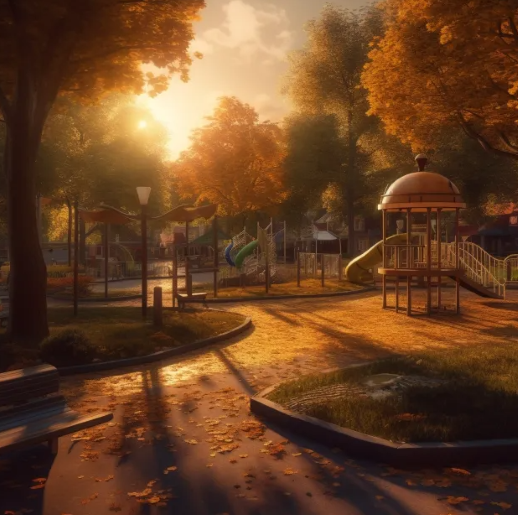 | 余晖照明：夕阳、晚霞等，或者金色阳光                         |
| Hard Lighting            | 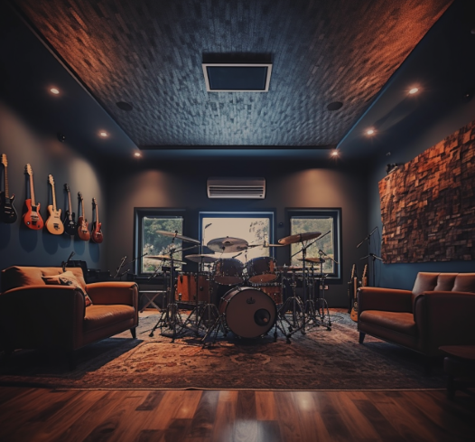 | 硬朗的照明。简洁明快的灯光风格，筒灯、聚光灯等灯具来聚焦，其光线是相对集中而直接的。 |
| Low Key Lighting         | 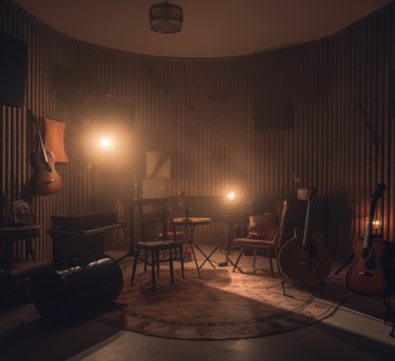 | 阴暗色调照明：通过侧光或背光和阴影来创造高对比度的画面效果。阴暗照明的特点是明暗分明、阴影浓重、暗调占主导地位，常常构建一种紧张、神秘或黑暗的氛围。 |
| Mood Lighting            | 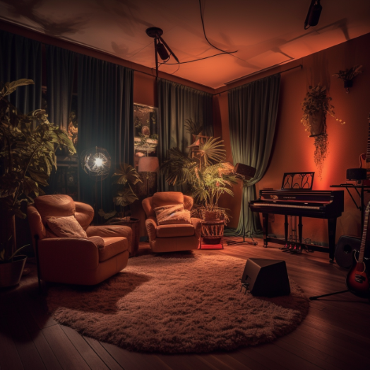    | 氛围照明：一种通过调整光线颜色、亮度和方向来营造特定氛围的照明方式，常用于家居、餐厅和酒店等场所。 |
| Moody Lighting           | 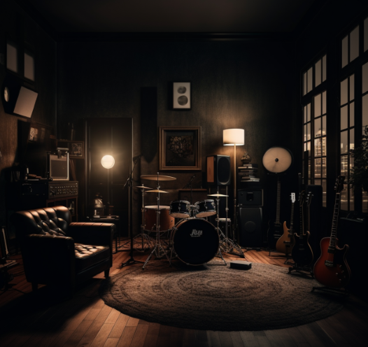 | 情绪灯：更强调在情感表达和为故事情节服务方面的应用，设计的目的是要把灯光与剧情完美结合起来，以展现角色的个性和情感世界。从技术实现上看，Moody lighting通常采用低亮度和大比例遮挡阴影，强调暗部的扫描，以增加画面的纹理和层次感。 |
| Morning Lighting         | 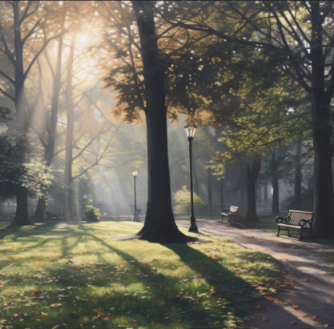 | 晨光：清晨的阳光照明，柔弱但蕴含着生命力。                   |
| Neon Lighting            | 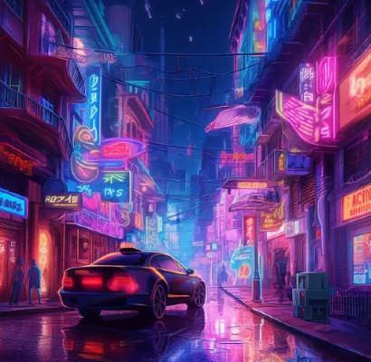 | 霓虹灯：街头繁华常见的灯光                                   |
| Soft Lighting            | 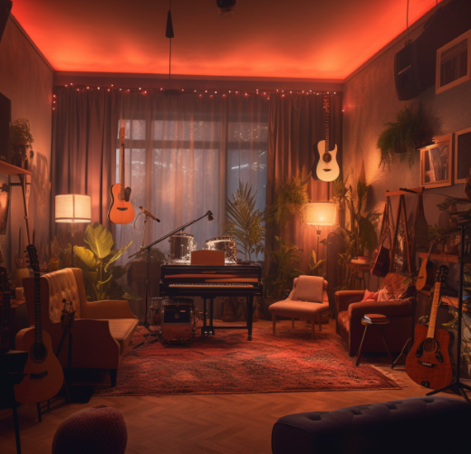 | 柔和的灯光：一种温暖、舒适的光线，通常用于创造轻松、宁静的氛围。 |
| Strobe Lighting          | 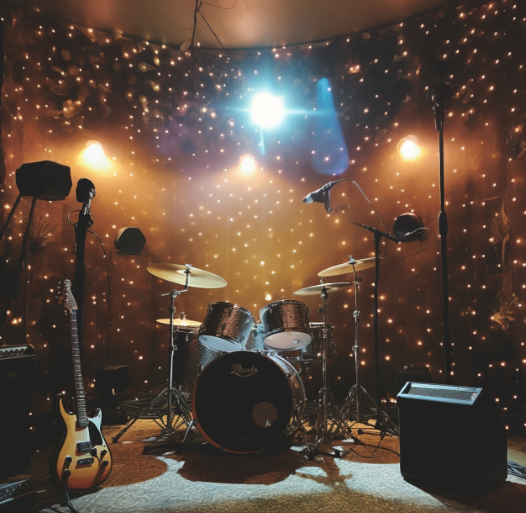 | 闪光灯：可以理解为蹦迪时候的灯光，酒吧、歌舞厅等地方常见     |
| Studio Lighting          | 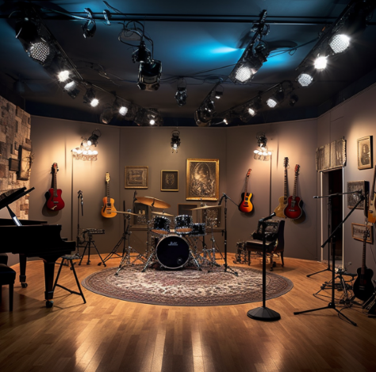 | 工作室灯光：工作室、排练室的灯光                             |
| Volumetric Lighting      | 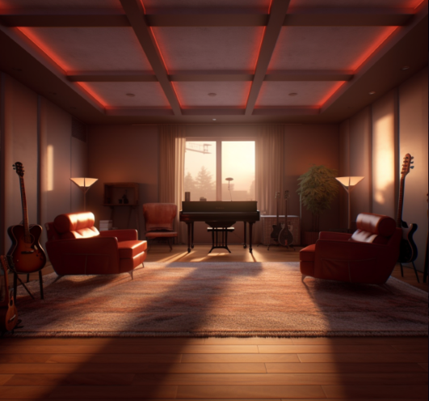 | 体积光：类似一束阳光从墙壁上照进来，可以看到这束光的轮廓，以及里面充满着各种空气中的悬浮颗粒 |
| Crepuscular Rays         | 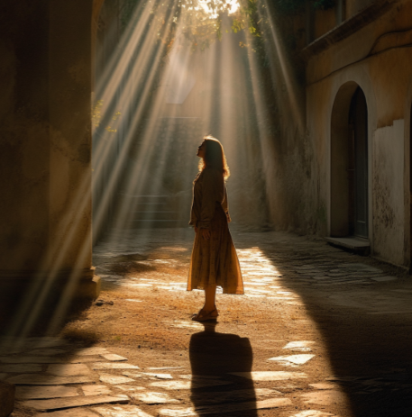 | 黄昏光、云隙光：是从云雾边缘射出的阳光，照亮空气中的灰尘，被称为耶稣光或上帝之梯，常被用作神圣、崇高、救赎的象征 |
| Sunbeams                 | 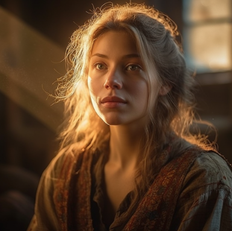       | 早晨的阳光：与“Crepuscular Rays”提示相比，颜色略黄。         |
| Shimmering Light         | 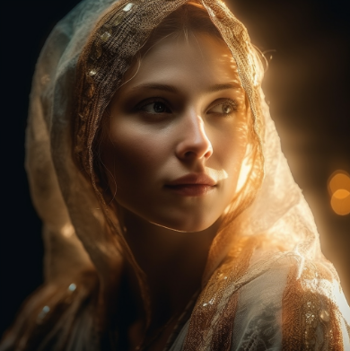 | 闪光的夜：柔软、金色的光                                     |
| Rembrandt Lighting       | 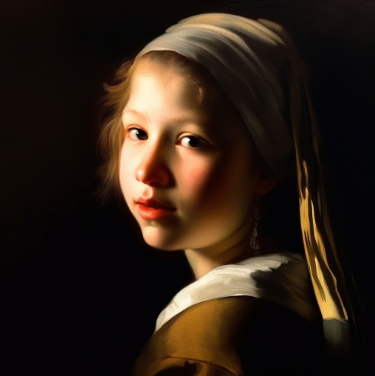 | 伦勃朗特效：画家伦勃朗画作体现的照明效果，其主要特点是在人物脸部形成一个菱形的明暗分界线，嘴巴和下巴的一侧用阴影覆盖，人物的另一侧则被亮光照亮。 |
| Veiling Flare            | 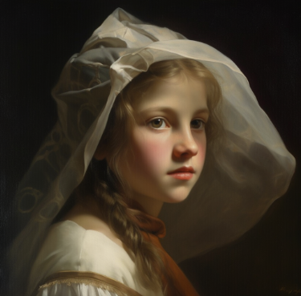 | 透镜毛玻璃：指当光线从透镜或镜头穿过时，透过玻璃或镜头的反光或散射使得图像出现散射光线或最终成像看起来失真的现象。 |
| Rays of Shimmering Light | 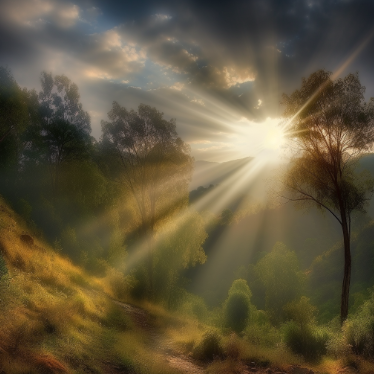 | 闪烁光线：是指在光线散射和折射时出现的光线折射现象。在某些特定的环境下，光线经过不同密度和温度不同的气氛，会出现一种光线折射、散射的效果，从而形成闪烁光束效果。 |
| Godrays                  | 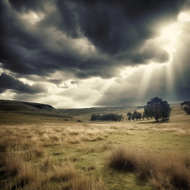         | 神光：是一种由光线穿过云朵、树枝或其他障碍物时，形成的亮光条纹效果，形成一种梦幻般的效果，也被称为 "crepuscular rays" 的一种。 |
| Conter-Jour              | 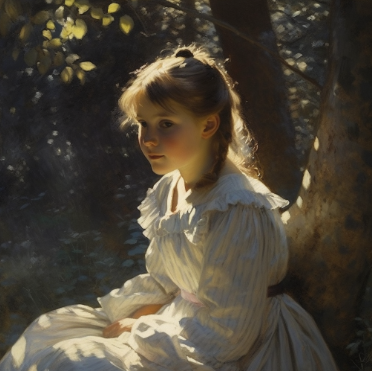 | 逆光照明：指的是摄影师将光源放置在被摄物体的背后，令照射效果在镜头前面产生，形成被摄体轮廓明显的负片形态。 |
| Bioluminescence          | 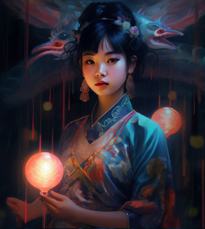 | 生物发光：是生物体发出的光。Midjourney将其解释为蓝光。       |
| Overcast                 | 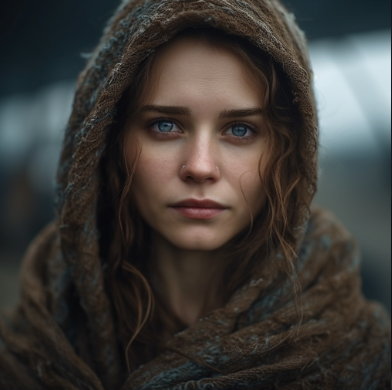       | 阴天光线：当乌云遮住太阳的时候。                             |
| Blue Hour                | 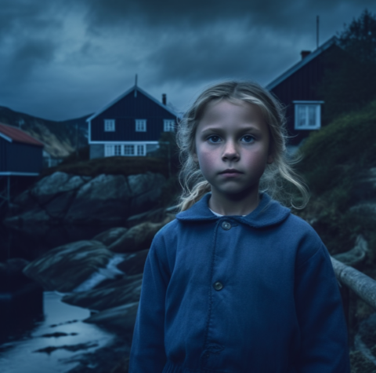     | 蓝光时刻：太阳大部分在地平线以下时发出的蓝光。               |
| Torchlit                 | 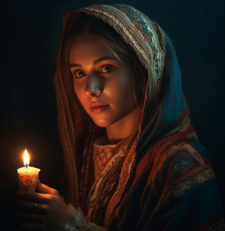       | 火把/蜡烛光：被火炬或火焰照亮的风景往往有一个发光点的阳光。  |

