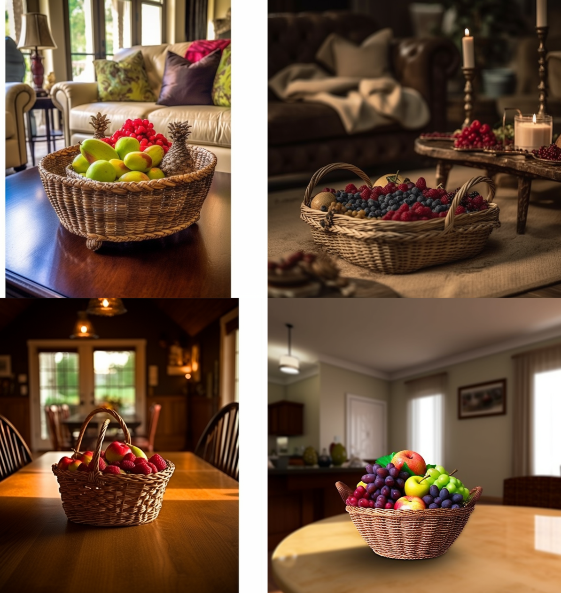

# No 排除
### `--no` 参数

`--no`参数在原理上可以理解为将某部分内容的权重设置为 "-.5" 。

#### 实例

Prompt:

`A basket of fruit on a brown table | photography | living room | bright Lighting | Camera : Nikon D850 --c 50`

假设我们不喜欢桔子，那么可以改一下prompt，增加`--no orange`参数，如下：

Prompt:

`A basket of fruit on a brown table | photography | living room | bright Lighting | Camera : Nikon D850 --c 50 --no orange`

你会发现，新生成的图片里面已经没有桔子了。