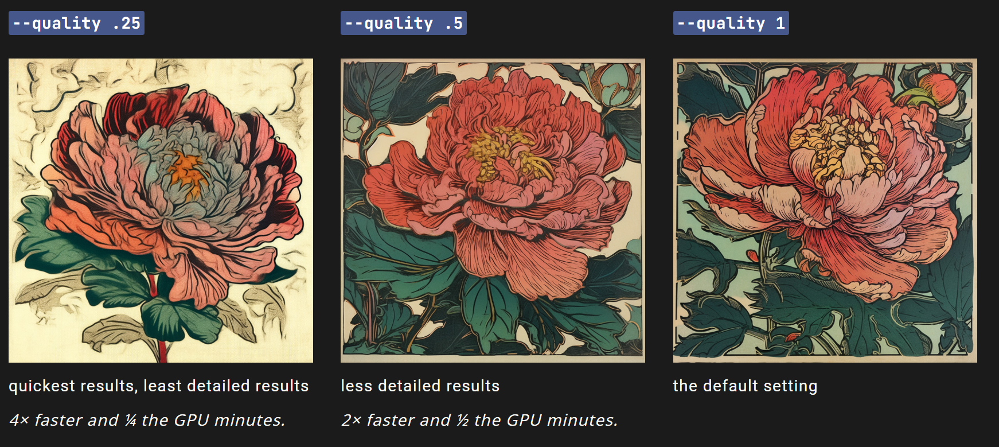

# Quality 细节

#### `——quality`或`——q `参数改变生成图像所花费的时间。

#### 更高质量会产生更多的细节。

#### 更高的值也意味着每个作业使用的时间越长（分钟数）。

#### 质量设置不影响分辨率。

> 默认的 `--quality` 值是 1.
> `--quality` 当前的模型版本仅可接受的取值为： .25, .5, 和1 . **更大的值会自动被将至 1.**
> `--quality` 只影响到初次的图像网格生成（和后面的优化无关）.
> `--quality` 支持 v4, v5 和 niji 5.

------

## Quality对作业的影响

更高的`--quality` 设置并不总是更好。有时，较低的`--quality` 设置可以产生更好的结果，这取决于你想要创建的图像。较低的`--quality` 设置可能最适合抽象的感官，更高的`--quality`值可能会在细节方面改善图像的感官。选择最符合你希望的设置就好。

### 各版本的Quality支持

| Model Version | Quality .25 | Quality .5 | Quality 1 |
| :-----------: | :---------: | :--------: | :-------: |
|   Version 5   |      ✓      |     ✓      |     ✓     |
|   Version 4   |      ✓      |     ✓      |     ✓     |
|    niji 5     |      ✓      |     ✓      |     ✓     |

------

### Version 5

Prompt 示例: `/imagine prompt` `detailed peony illustration --q .25`

------

## 用法

### 使用 `--quality` 或 `--q` 参数

在prompt的最后加上`--quality <value>` 或`--q <value>` .

