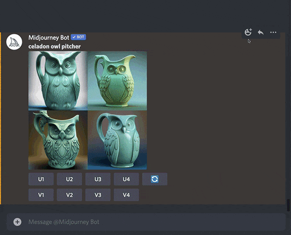

# Seeds

#### Midjourney机器人使用seed（种子号）来创建一个视觉噪声场，就像电视静态一样，作为生成初始图像网格的起点。每个图像随机生成种子号，但可以使用`——Seed `或`——sameseed `参数指定。使用相同的种子号和prompt将产生相似的结束图像。

- `--seed` 的允许数值范围： 0–4294967295.
- `--seed` 的值只影响初始图像网格.
- 相同的`——seed`值使用`1`，`2`，`3`，`test`和`testp`将生成具有相似构图，颜色和细节的图像。
- 相同的 `--seed`值使用`4`、`5`和`niji`会产生几乎相同的图像。
- 种子数不是静态的，不应该依赖于会话之间。

------

## Seed 参数

如果没有指定Seed, Midjourney将使用随机生成的Seed编号，每次使用prompt时都会产生各种各样的选项。

### 使用随机种子运行三次作业:

prompt 示例: `/imagine prompt` `celadon owl pitcher`

没有指定seed，随机性会比较大，各网格图片的差异还是比较明显的，特别是猫头鹰的长相方面。

### 强行指定一个seed值： `--seed 123`，然后再跑两次:

prompt 示例: `/imagine prompt` `celadon owl pitcher --seed 123`

生成的图片网格里面的图的相似度是很高的。

------

## 如何找到Seed值

### 在Discord中点击表情符号（Emoji）获得

在Discord中搜索`envelope`，点击信封，你其实可以看下面的动图就明白了。

### 使用Show命令恢复旧的工作

要获取过去作业（Job）的种子号，使用带有该ID的` /show <Job ID #> `命令来恢复作业。然后你可以用✉️信封表情符号来回应新生成的工作。

------

## Seed Numbers用法

### 使用 `--seed` 参数

在prompt最后加上`--seed <value>`后缀.

