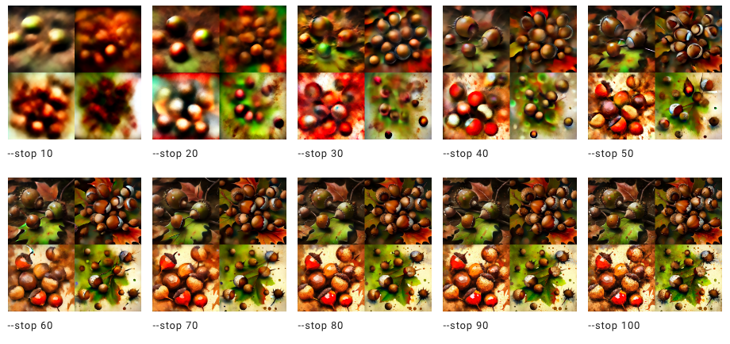

# STOP （完成度参数）

#### 使用`——stop`参数是在生成图片过程中控制完成度，在进度未达到100%的时候停止作业可能会产生模糊、不太细致的结果。

> `--stop` 取值: 10–100.  
> 默认的 `--stop` 值是 100.  
> `--stop` 在**Upscaling**阶段无效.

---

## Stop 效果比较

prompt 示例: `/imagine prompt` `splatter art painting of acorns --stop 90`

---

## 如何使用 Stop 参数

增加 `--stop <value>` 在你的prompt末尾.

