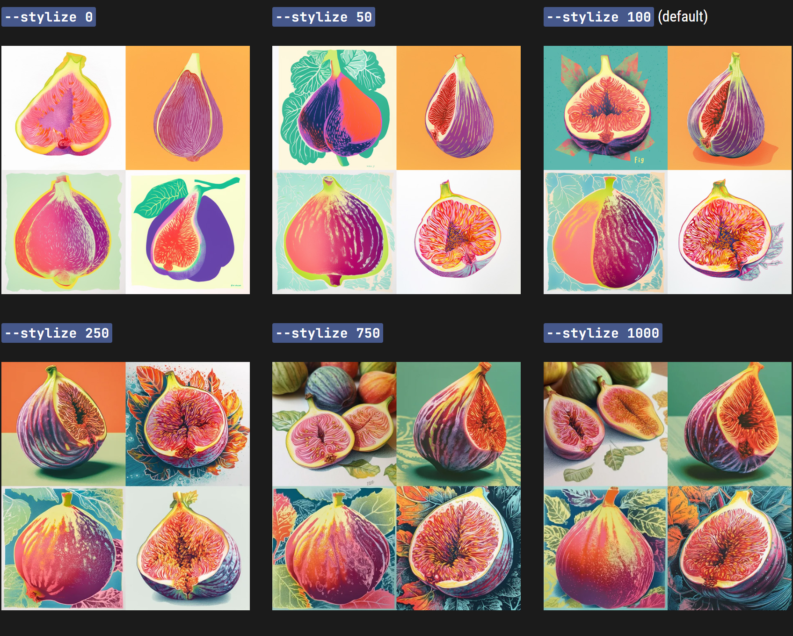
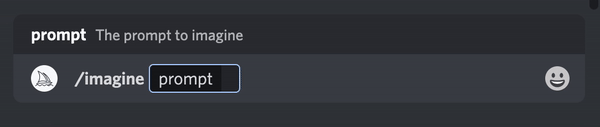

# Stylize

------

#### Midjourney机器人经过训练，可以制作出适合艺术色彩、构图和形式的图像。`——stylize`或`——s`参数影响应用此训练的强度。低风格化值产生的图像与prompt非常匹配，但艺术性较差。高风格化值创建的图像非常有艺术性，但与prompt的联系较少。

`--stylize`的默认值是 100，可接受的整数范围是 0–1000 [V4以上].


**各版本之间对于Stylize参数的不同可用值可参看如下表格：**

|                 | Version 5 | Version 4 | Version 3 | Test / Testp | niji |
| :-------------: | :-------: | :-------: | :-------: | :----------: | :--: |
| Stylize default |    100    |    100    |   2500    |     2500     |  NA  |
|  Stylize Range  |  0–1000   |  0–1000   | 625–60000 |  1250–5000   |  NA  |


------

## Stylize设置

### Midjourney  V4

prompt 示例: `/imagine prompt` `illustrated figs --s 100`


------

### Midjourney V5

prompt 示例: `/imagine prompt` `colorful risograph of a fig --s 100`




------

## 如何切换Stylization值

### 直接添加Stylize参数后缀

直接在prompt后面增加`--stylize <value>` 或`--s <value>`  .



### 使用Settings指令

在Discord的输入框中键入`/settings` 然后在stylize菜单下面选择如下选项.

```
🖌️ Style Low` `🖌️ Style Med` `🖌️ Style High` `🖌️ Style Very High
```