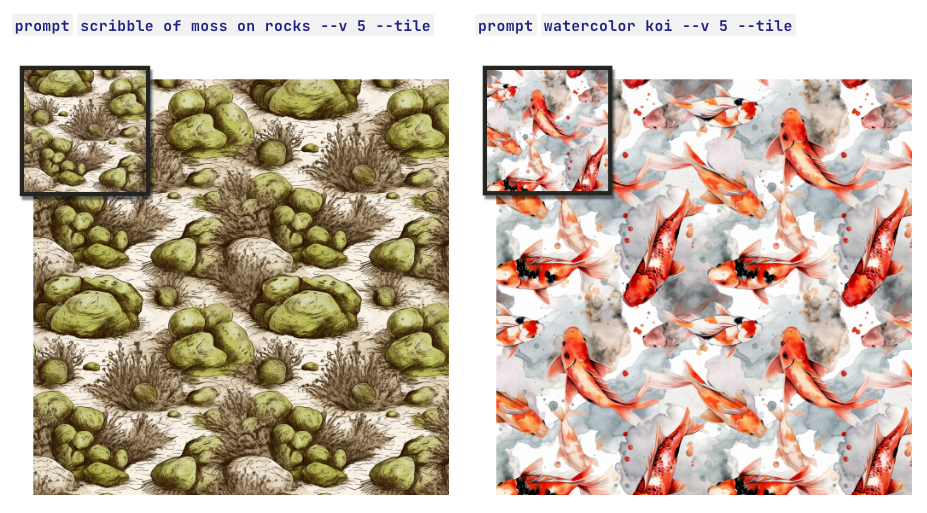

# Tile（循环平铺）

# Tile使用

#### `--tile`参数生成可以循环生成图像，就像瓷砖那样重复图案，为织物、壁纸和纹理创建无缝图案。

> `--tile` 在Versions`1`, `2`, `3`, `test`, `testp`, `5`, and `5.1`均可用.

> `--tile` 目前只能生成单个图案的循环，如果需要制作更复杂的图案，可以先用类似这样的图案制作工具：[无缝图案检查器](https://www.pycheung.com/checker/)。

------

## Tile案例

## 如何使用Tile参数

将 `--tile`添加到prompt的结尾.

