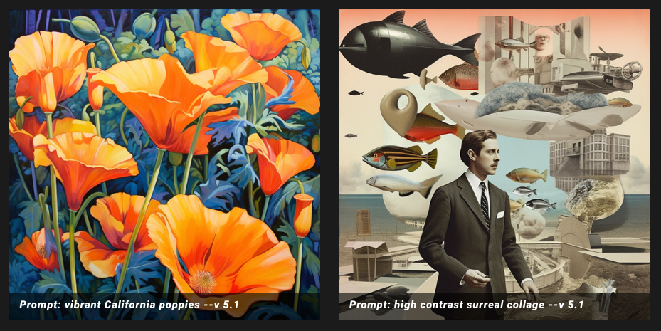
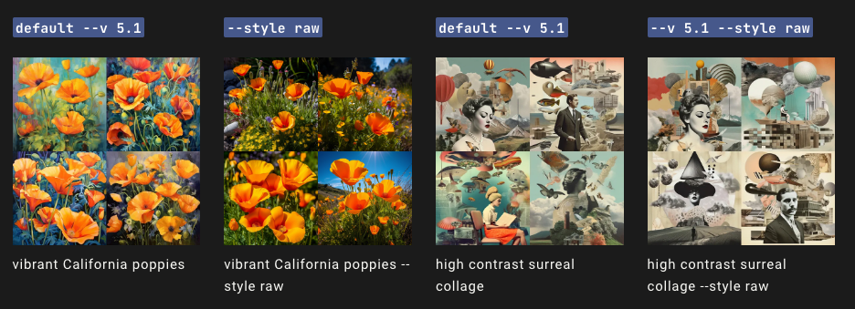
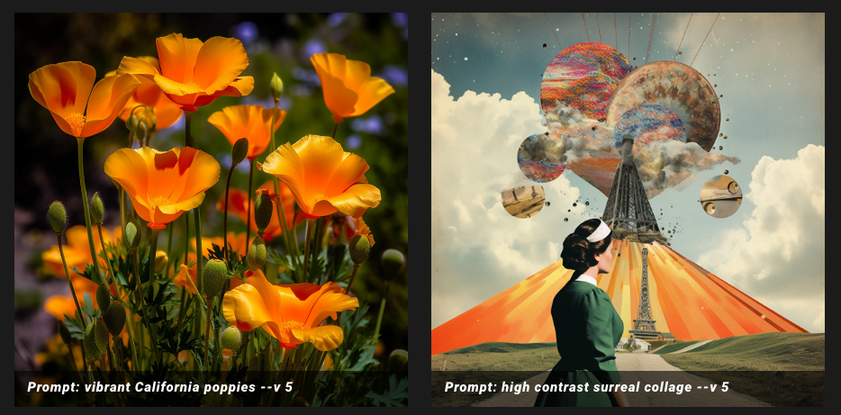
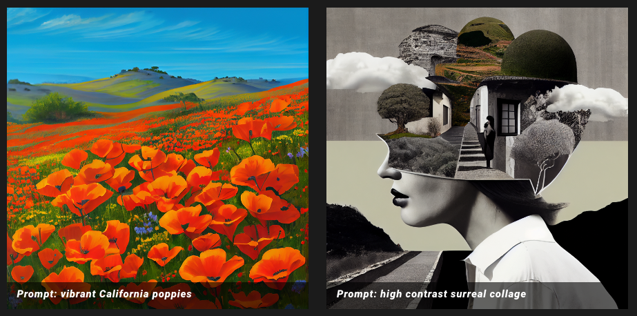
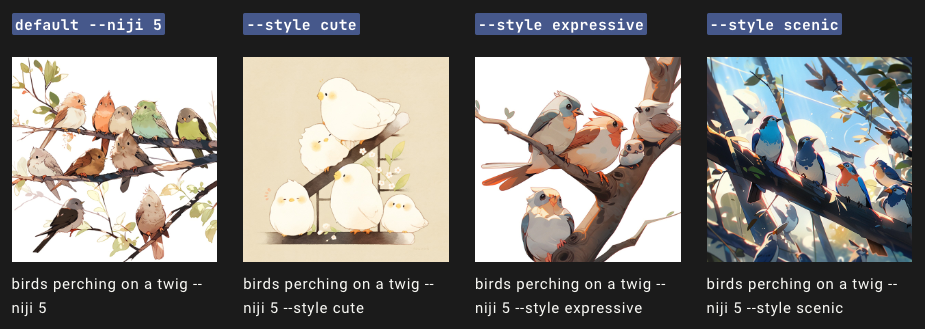
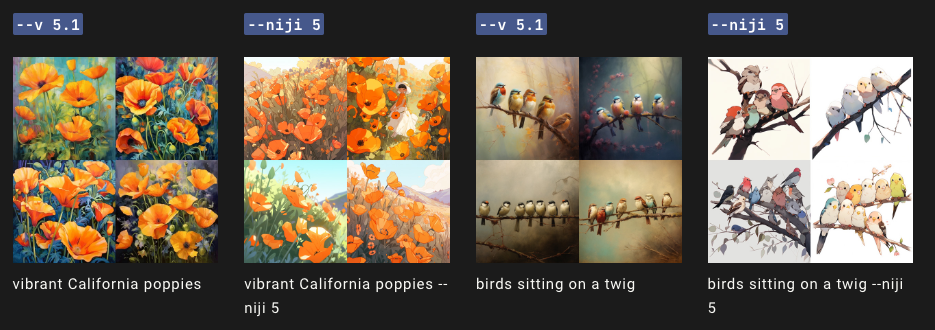

# Version 版本

Midjourney定期发布新的模型版本以提高效率、连贯性和质量。最新的模型是默认的，但可以通过添加--version或--v参数或使用/settings命令并选择一个模型版本来使用其他模型。每个模型都擅长生成不同类型的图像。

> --version接受值为1、2、3、4、5和5.1。
> --version可以缩写为--v。

## 当前默认模型版本 v5.1

Midjourney V5.1模型是最新和最先进的版本，于2023年5月4日发布。要使用此模型，请在提示的末尾添加--v 5.1参数(**建议的方式**)，或使用/settings命令并选择`5️⃣ MJ Version 5.1`。

该模型具有更强的默认美学风格，使其更易于与简单文本提示一起使用。它还具有高连贯性，在准确解释自然语言提示方面表现出色，产生的不良伪影和边框更少，并且图像锐度增加，并支持高级功能，如通过`--tile`重复图案。

### Model Version 5.1 + Style Raw Parameter (原始风格参数) 

Midjourney模型版本5.1可以通过使用`--style`参数`--raw`进行微调，以去除一些默认的Midjourney美学风格。

------

## V5 vs  V4

V5的效果：比默认的5.1型号产生更多的照片生成。该模型可以生成与提示相匹配的图像，但可能需要更长时间的提示才能实现您所需的美学效果。

V4的效果：与以前的模型相比，第四版具有更多**关于生物、地点和物体方面的知识**。

------

## Niji Model 5

Niji模型是Midjourney和Spellbrush之间的合作，旨在以更深入的**动漫知识、动漫风格和动漫美学**来呈现出动画和插图风格。它非常擅长于展现具有活力与行动感的场景以及角色为中心的构图。

该模型对`--stylize`参数非常敏感。尝试使用不同的样式化范围来优化您的图像。

### Niji Style Parameters

Niji模型版本5还可以通过--style参数进行微调，以实现独特的外观。尝试使用`--style cute`、`--style scenic`或`--style expressive`。

以下分别是原始niji 5、niji 5 可爱风、niji 5 表现力增强 和niji 5 风景画风格的效果。

### Niji 5 vs. Midjourney Version 5.1

下面来看一下Niji 5和最新的V 5.1之间的区别：

------

